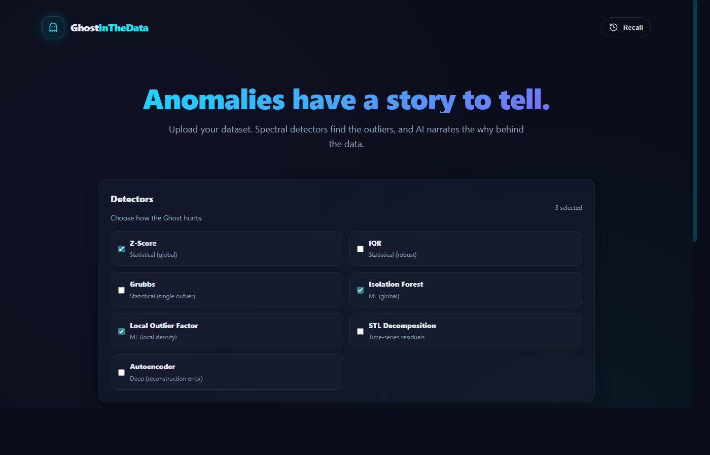

# Ghost in the Data

An AI-powered anomaly storyteller: upload a CSV, detect outliers with multiple detectors, enrich with real-world context, and generate a narrative explaining *why* the anomaly might have happened.

## Screenshots



## Quickstart (Docker, dev)

1) Create backend env file:
- Copy `backend/.env.example` -> `backend/.env`
- Fill in `GOOGLE_API_KEY` (Gemini) and optionally `NEWSDATA_API_KEY` (news context).

2) Create frontend env file (optional):
- Copy `frontend/.env.example` -> `frontend/.env`
- Optionally set `VITE_SOURCE_URL` to your GitHub repo URL.

3) Run:
```bash
docker compose up -d --build
```

4) Open:
- Frontend: `http://localhost:5173`
- Backend API docs: `http://localhost:8000/docs`

## Production-like stack (Docker)

This uses:
- Backend: Gunicorn + Uvicorn workers
- Frontend: Vite build served by Nginx
- Nginx proxies `/api/*` to the backend so the UI can use same-origin `/api`.

Run:
```bash
docker compose -f docker-compose.prod.yml up -d --build
```

Open:
- Frontend: `http://localhost:8080`
- Backend health (via proxy): `http://localhost:8080/api/health`

## Run backend tests (Docker)

The host machine doesn't need Python installed.

```bash
docker compose run --rm backend sh -lc "pip install -r requirements-dev.txt && pytest"
```

## End-to-end smoke test (Windows)

```powershell
powershell -ExecutionPolicy Bypass -File .\scripts\smoke.ps1
```

## Recall + persistence verification (Windows)

```powershell
powershell -ExecutionPolicy Bypass -File .\scripts\verify_recall.ps1
```

## Autoencoder detector

There is an **Autoencoder** detector option (PyTorch), with a fallback model when PyTorch is unavailable.

## What the News API does

The backend uses **NewsData.io** to fetch a few relevant articles around an anomaly's timestamp (if present). Those articles are:
- shown as "External context" links in the UI
- used as extra grounding context for Gemini

If no timestamp exists (or no `NEWSDATA_API_KEY` is provided), narration still works — it just skips external context.

## Important notes

- **Do not commit secrets**: keep `backend/.env` and `frontend/.env` local.
- If you ever pasted or screenshotted an API key publicly, rotate it immediately in the provider console.
